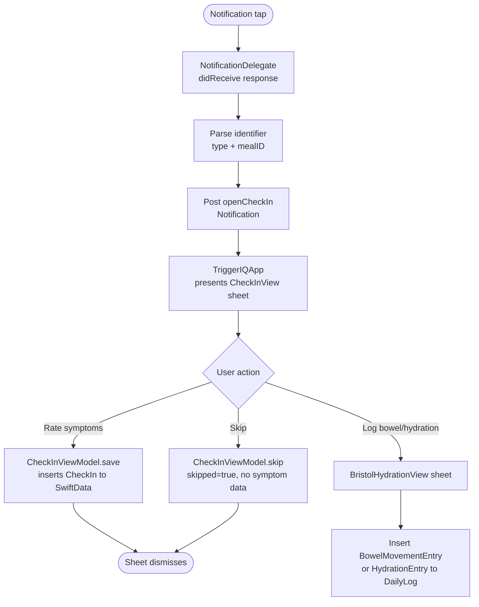
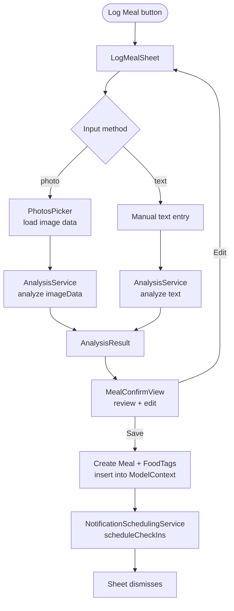
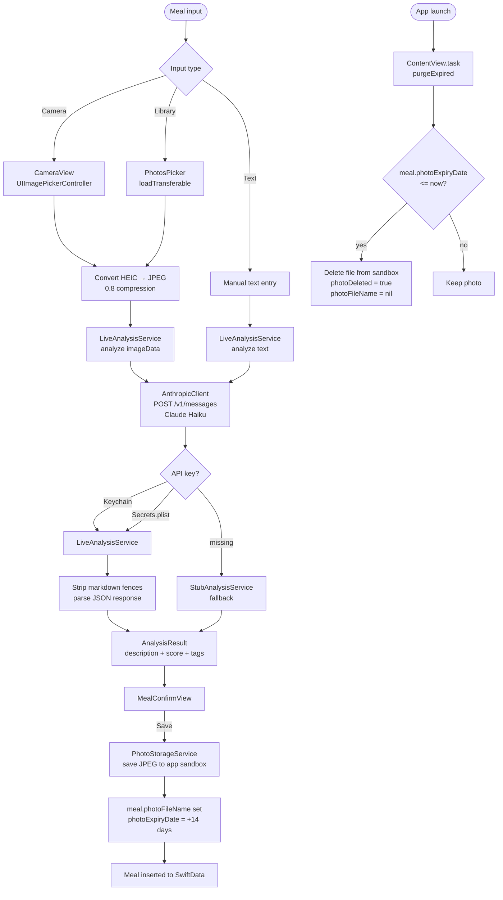
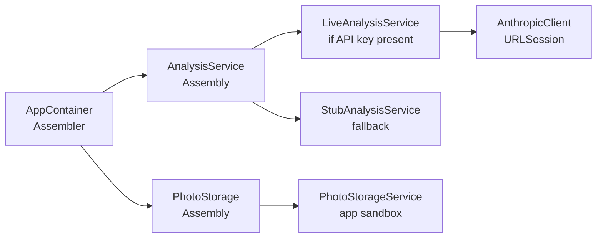

# TriggerIQ — Architecture Diagrams

## App Startup — Permission Flow

---

## Meal Saved — Notification Scheduling Flow

---

## DI — Assembly & Resolution

---

## HealthKit Daily Cache Flow

---

## Epic 4 — Check-in Flow

---

## Epic 3 — Meal Logging Flow

---

## DI — Assembly & Resolution (Epic 3)

---

## Epic 5 — Today Screen

---

## Epic 7a — AI Analysis (Claude API)

---

## Epic 7a — DI Assembly

---

## Epic 6 — History & Meal Detail

