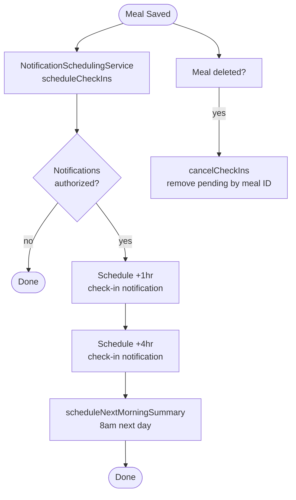

# TriggerIQ — Architecture Diagrams

## App Startup — Permission Flow

```mermaid
flowchart TD
    A([App Launch]) --> B[TriggerIQApp.task]
    B --> C[NotificationPermissionManager\nrequestPermissionIfNeeded]
    B --> D[HealthKitService\nrequestAuthorization]
    C --> E{UNAuth\nStatus?}
    E -->|notDetermined| F[Show system\nnotification prompt]
    E -->|authorized\ndenied| G[Skip]
    D --> H{HealthKit\navailable?}
    H -->|yes| I[Request read\npermissions]
    H -->|no| J[Skip]
```

---

## Meal Saved — Notification Scheduling Flow

```mermaid
flowchart TD
    A([Meal Saved]) --> B[NotificationSchedulingService\nscheduleCheckIns]
    B --> C{Notifications\nauthorized?}
    C -->|no| D([Done])
    C -->|yes| E[Schedule +1hr\ncheck-in notification]
    E --> F[Schedule +4hr\ncheck-in notification]
    F --> G[scheduleNextMorningSummary\n8am next day]
    G --> H([Done])
    A --> I[Meal deleted?]
    I -->|yes| J[cancelCheckIns\nremove pending by meal ID]
```

---

## DI — Assembly & Resolution

```mermaid
flowchart LR
    AC[AppContainer\nAssembler] --> NA[NotificationService\nAssembly]
    AC --> HA[HealthKitService\nAssembly]
    NA --> NCP[NotificationCenter\nProtocol]
    NA --> NPM[NotificationPermission\nManager]
    NA --> NSS[NotificationScheduling\nService]
    HA --> HKS[HealthKitService\nProtocol]
    R([resolve&lt;T&gt;]) --> AC
```

---

## HealthKit Daily Cache Flow

```mermaid
flowchart TD
    A([fetchAndCacheDaily\ndate + ModelContext]) --> B{DailyLog\nexists for date?}
    B -->|yes| C[Update existing]
    B -->|no| D[Create new DailyLog]
    C --> E
    D --> E[Fetch in parallel]
    E --> F[Sleep duration\n+ quality %]
    E --> G[HRV\nresting HR]
    E --> H[Step count]
    E --> I[Workout\nduration]
    F & G & H & I --> J[Write to DailyLog]
    J --> K[context.save]
```
