# TriggerIQ — Architecture Diagrams

## App Startup — Permission Flow

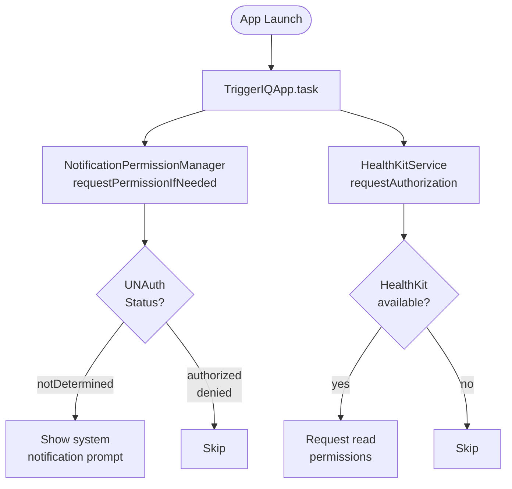

---

## Meal Saved — Notification Scheduling Flow


---

## DI — Assembly & Resolution

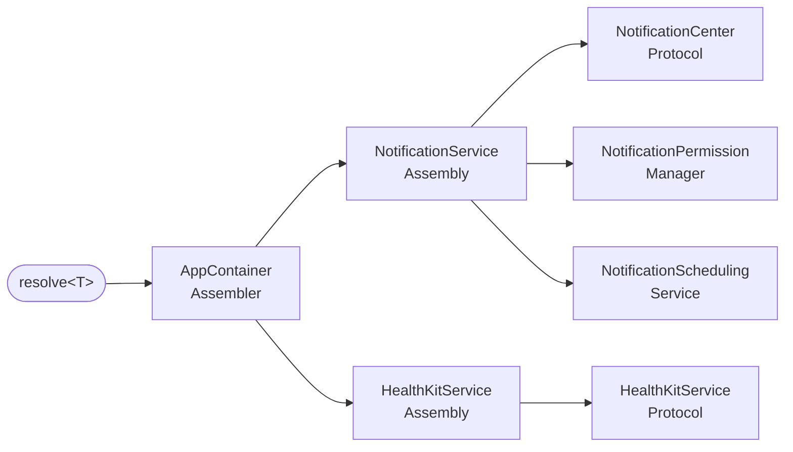

---

## HealthKit Daily Cache Flow

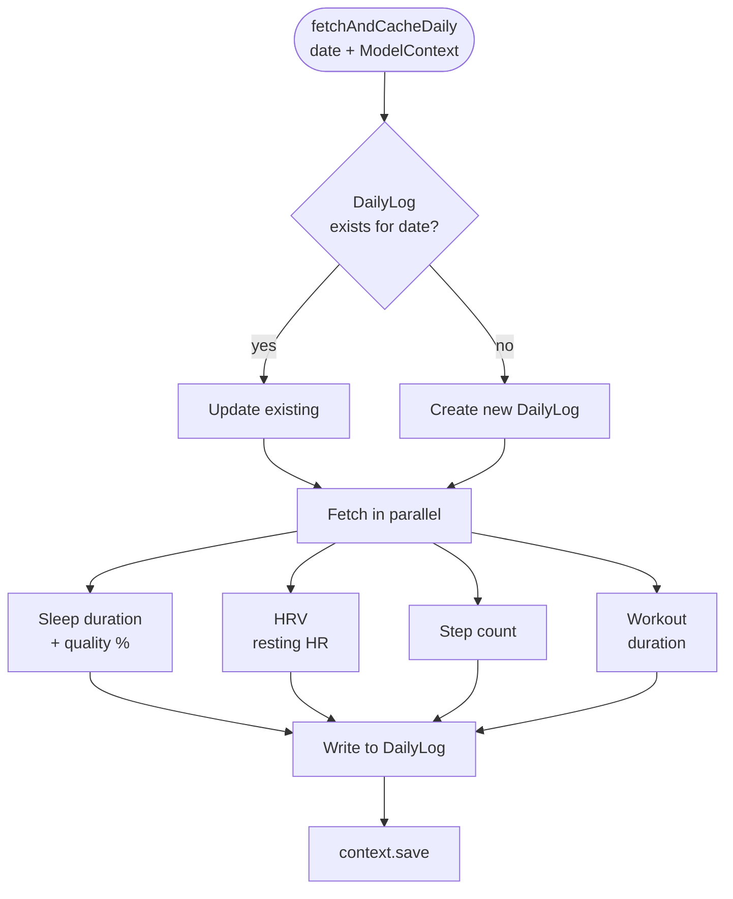

---

## Epic 4 — Check-in Flow

```mermaid
flowchart TD
    A([Notification tap]) --> B[NotificationDelegate\ndidReceive response]
    B --> C[Parse identifier\ntype + mealID]
    C --> D[@Published pendingCheckIn\non NotificationDelegate]
    D --> E[TriggerIQApp\npresents CheckInView sheet]
    E --> F{User action}
    F -->|Rate symptoms| G[CheckInViewModel.save]
    F -->|Skip| H[CheckInViewModel.skip\nskipped=true, no symptom data]
    F -->|Log bowel/hydration| I[BristolHydrationView sheet]
    I --> J[Insert BowelMovementEntry\nor HydrationEntry to DailyLog]
    G --> K[Insert CheckIn\ncompletedTime = now]
    K --> L[voidSupersededCheckIns\ncreate skipped records for earlier types]
    L --> M[cancelCheckIns for meal\nremove pending OS notifications]
    M --> N([Sheet dismisses\nToday banner clears])
    H --> N
```

---

## Epic 3 — Meal Logging Flow


---

## DI — Assembly & Resolution (Epic 3)

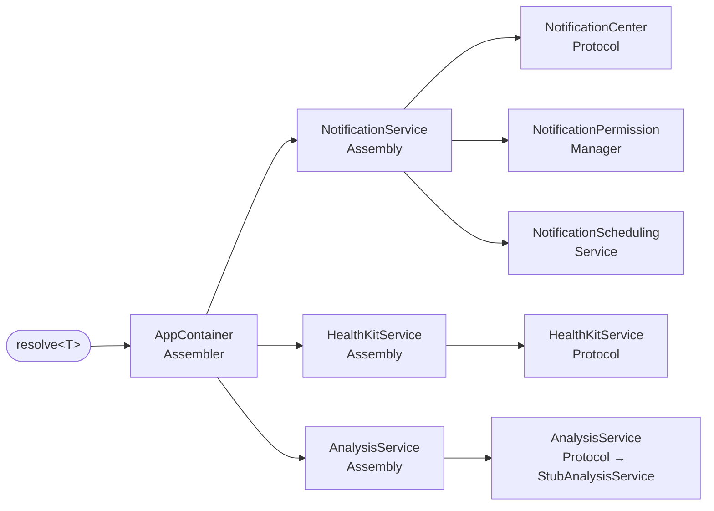


---

## Epic 5 — Today Screen

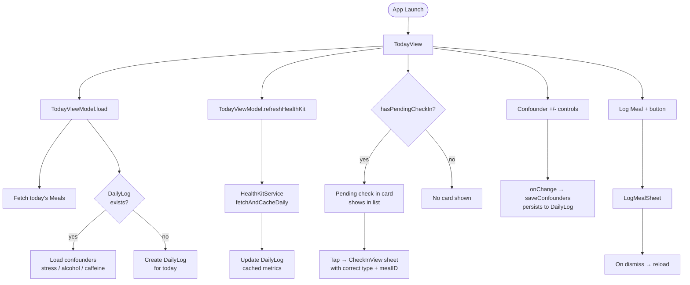

---

## Epic 7a — AI Analysis (Claude API)


---

## Epic 7a — DI Assembly

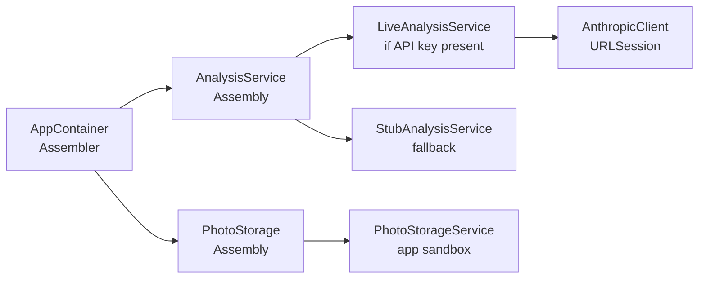

---

## Epic 7 — Insights Screen

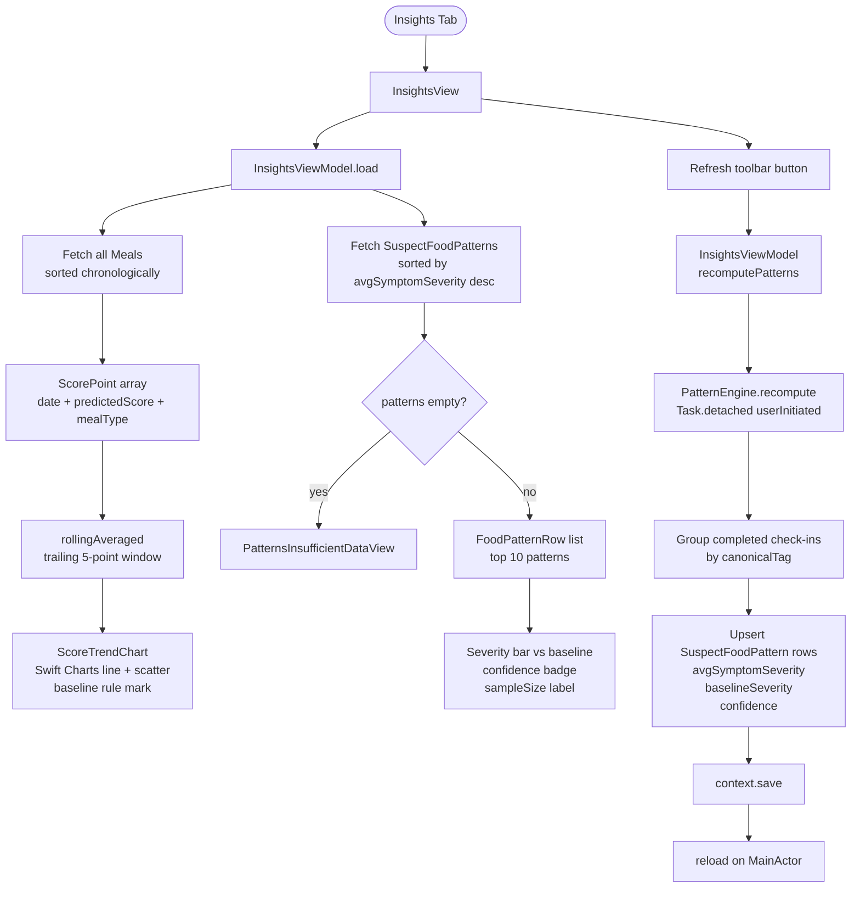

---

## Epic 7 — Pattern Engine Logic

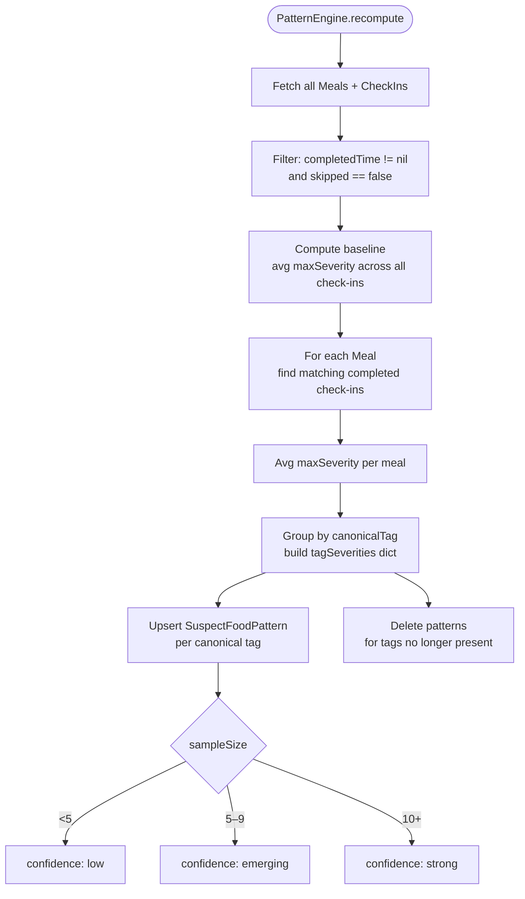

---

## DI — Assembly & Resolution (Epic 7)

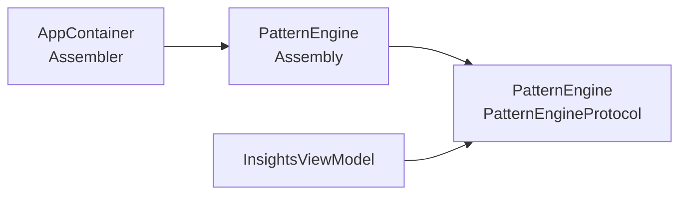

---

## Epic 8 — Onboarding & Settings

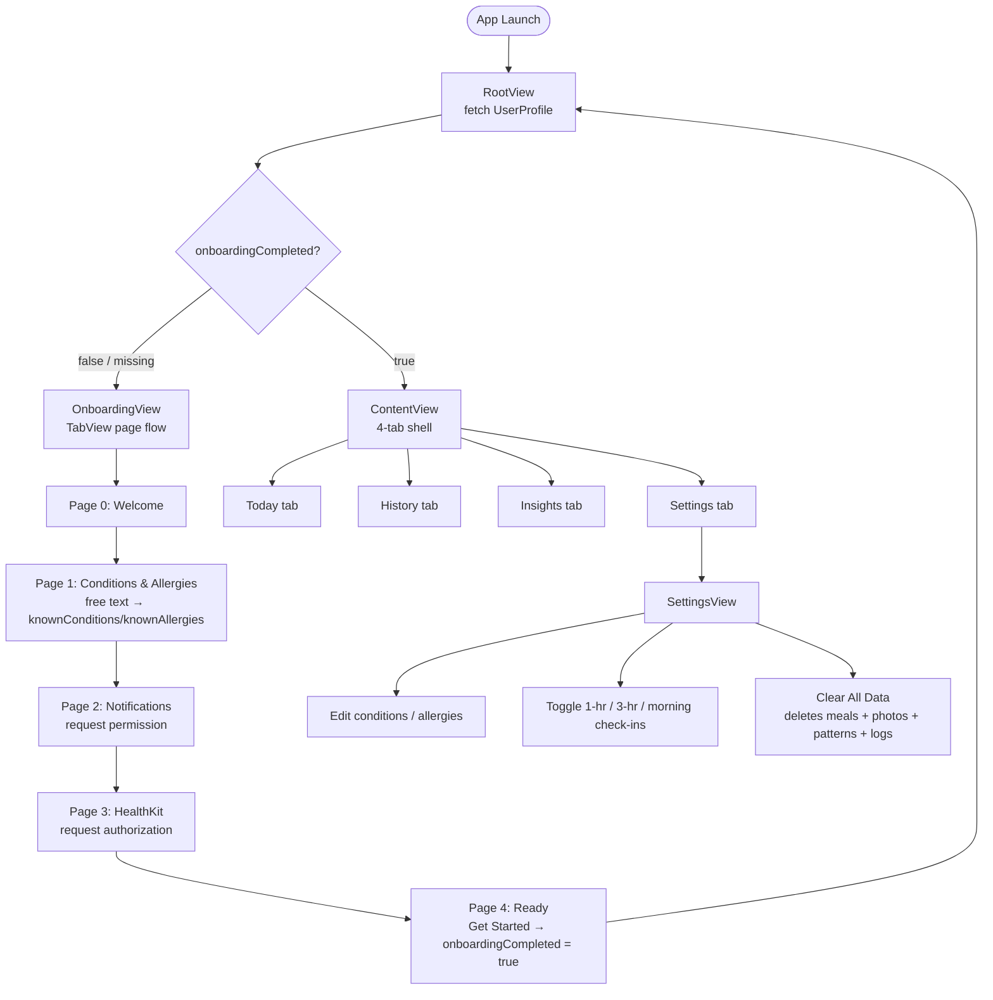

---

## Epic 8 — Meal Type Preselection

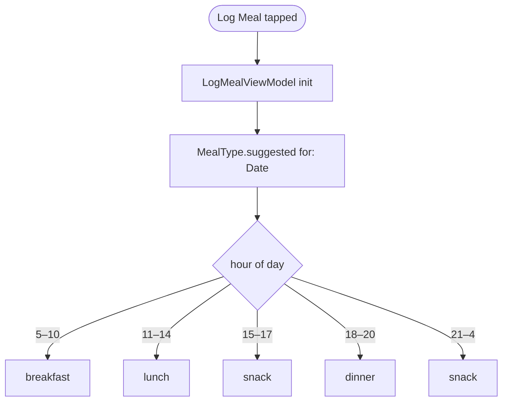

---

## Epic 6 — History & Meal Detail

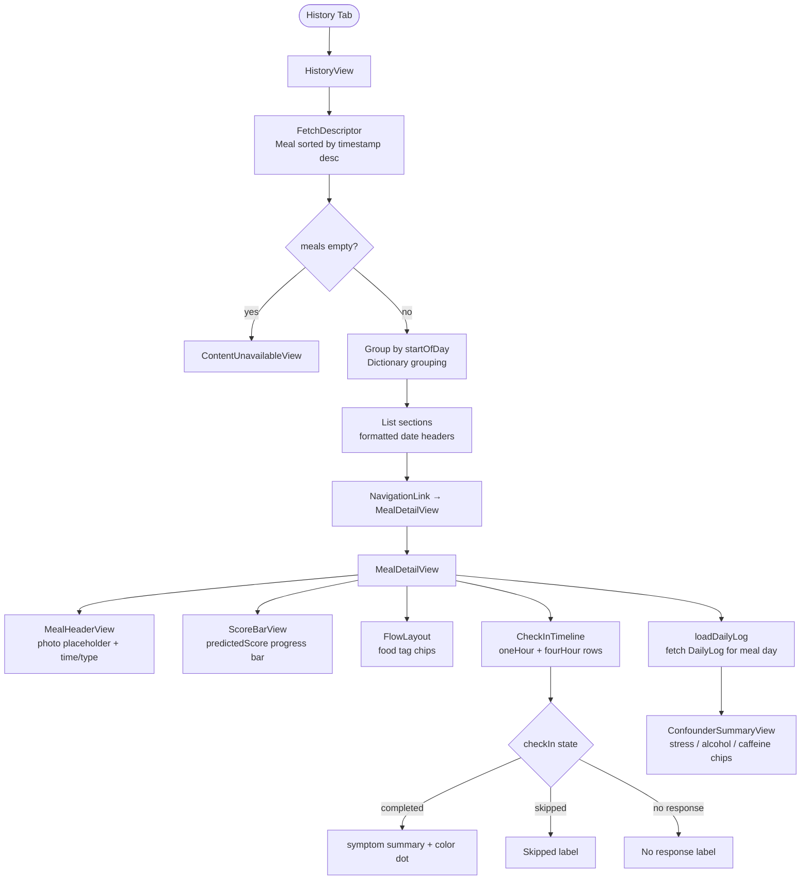
